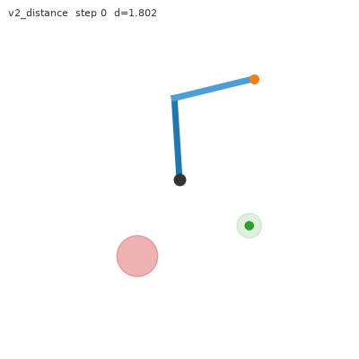
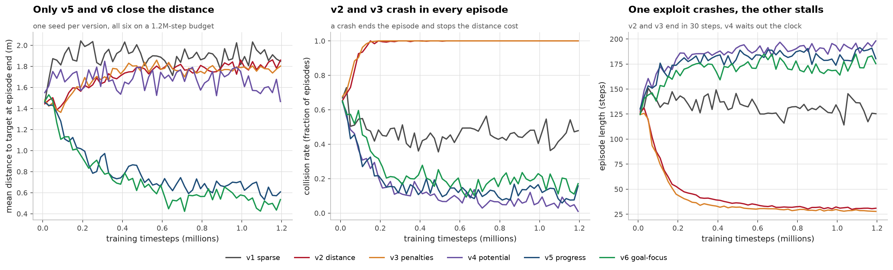
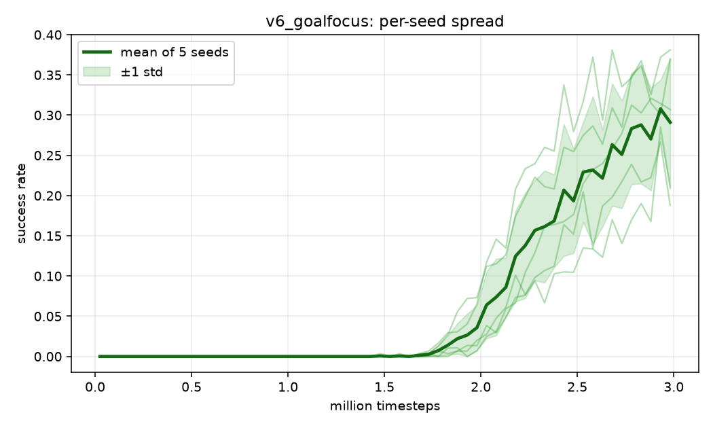
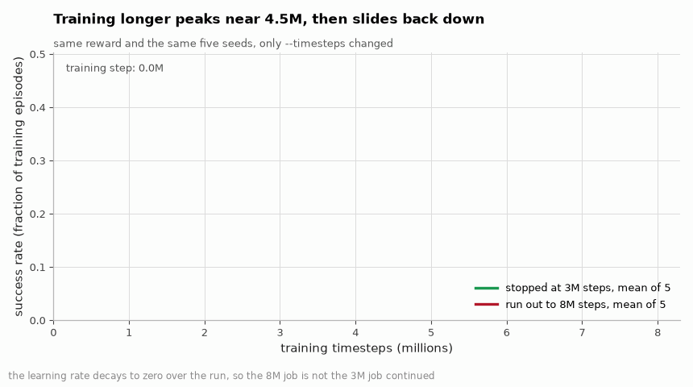

# Teaching an arm to stop, not just arrive

[](https://github.com/aghasalim/rl-arm-reward-shaping/actions/workflows/ci.yml)
[](https://github.com/aghasalim/rl-arm-reward-shaping/actions/workflows/demo.yml)
[](https://www.python.org/)
[](LICENSE)

**[▶ Live demo](https://rl-arm-reward-shaping.streamlit.app/)**: the exploits on
video and the per-seed spread.

A 2-link torque-controlled arm has to reach a randomly placed target and stay
there, with an obstacle in the workspace. I built the environment, wrote six
reward functions, and the agent exploited two of them in ways I did not see
coming. The final agent scores **43.2% ± 5.8%** success over five seeds, against
**73.5%** for a hand-written PD controller, which I am not going to hide. It wins
on one axis, collisions, 17.3% against the oracle's 25.5%, because a PD
controller tracking an inverse-kinematics solution drives straight through
obstacles and the policy learned to go around.

Full write-up in **[notes/METHODS.md](notes/METHODS.md)**, working log in
**[NOTES.md](NOTES.md)**.

## The task

The success criterion was fixed **before any training** and never adjusted:

> Within **5 cm** of the target, **both joints under 0.1 rad/s**, held for
> **10 consecutive steps**, no obstacle contact, inside **200 steps**.

The arm is planar and viewed from above, so there is no gravity term, and the
obstacle is drawn at random along with the target. Each step is 20 ms, so the
200-step limit gives the arm 4 seconds to travel and settle. Touching a target is
a tutorial exercise; arriving and stopping is where reward functions get
exploited. [More](notes/METHODS.md#1-the-task).

## The two exploits

**v2, distance reward.** It paid `-distance` every step with no collision penalty,
and a collision ends the episode, which stops the cost accruing. The agent found
this in **200 out of 200** evaluation episodes, and the `-5` penalty I added in v3
was no deterrent against a `-100` alternative.
[Arithmetic](notes/METHODS.md#1-the-agent-killed-itself-to-stop-the-bleeding).



*v2. The arm makes straight for the red circle, in ~30 steps.*

**v4, potential-based shaping**, from Ng, Harada & Russell (1999): `F = γΦ(s′) −
Φ(s) ` with ` Φ = −distance `. Collisions dropped to 4.0% and the arm stopped moving,
96.0% of episodes timed out, because a stationary agent earns `(1 − γ)·d` per step
and loitering at 2 m pays `+20.0` an episode, exactly the success bonus. Policy
invariance assumes an infinite horizon; under a 200-step cutoff that term is
income. [Derivation](notes/METHODS.md#2-the-agent-farmed-my-provably-safe-shaping).


*v4. It drifts, then parks and waits out the clock, and is paid to.*

## The bug that wasn't a reward bug

Both exploits fixed, the agent still solved nothing, so I wrote a PD controller
with exact inverse kinematics to ask whether the criterion was achievable at all.
At my original torque limit it scored **65.0%** with the obstacle removed: the arm
was under-actuated, and I had been trying to fix impossible episodes with reward
functions. [Torque table](notes/METHODS.md#3-the-bug-that-wasnt-a-reward-bug).

## Results

Same three layouts in every clip, so a later checkpoint cannot look better by
drawing easier targets.

| 200k steps | 2M steps | 3M steps (final) |
|---|---|---|
|  |  |  |
| 3 timeouts | 2 successes, 1 timeout | 3 successes |





Every policy is scored on the same fixed criterion over the same 200 held-out
layouts (seeds 10000 to 10199, disjoint from training), deterministic actions.
Training reward is never compared across versions. Full table in
[reports/results.md](reports/results.md).

| reward | steps | success | collision | timeout | reached target | settled given reached | final dist |
|---|---|---|---|---|---|---|---|
| random policy | - | 0.0% | 45.0% | 55.0% | 10.0% | 0.0% | 1.652 m |
| v1 sparse | 1.2M | 0.0% | 42.0% | 58.0% | 4.0% | 0.0% | 1.921 m |
| v2 distance | 1.2M | 0.0% | **100.0%** | 0.0% | 7.0% | 0.0% | 1.832 m |
| v3 penalties | 1.2M | 0.0% | **100.0%** | 0.0% | 4.0% | 0.0% | 1.691 m |
| v4 potential | 1.2M | 0.0% | 4.0% | **96.0%** | 9.0% | 0.0% | 1.512 m |
| v5 progress | 1.2M | 0.0% | 11.5% | 88.5% | 22.0% | 0.0% | 0.594 m |
| v6 goal-focus | 1.2M | 0.0% | 14.0% | 86.0% | **45.5%** | 0.0% | 0.440 m |
| **v6 goal-focus** (5 seeds) | 3M | **43.2% ± 5.8%** | 17.3% | 39.5% | 67.1% | 64.2% | **0.371 m** |
| *PD oracle (no learning)* | - | *73.5%* | *25.5%* | - | - | - | - |

Rows 2 to 7 share a 1.2M-step budget. v6 at 1.2M still scores 0% while reaching
the target three times as often as any earlier version: the reward change and the
budget both had to be right.
[Column by column](notes/METHODS.md#4-results-in-full).

### Training longer made it worse

Same code, same five seeds, only `--timesteps` changed:

| training steps | success (5 seeds) |
|---|---|
| 3M | **43.2% ± 5.8%** |
| 8M | **18.0% ± 6.6%** |



*Both runs as they train, five seeds each. The 8M run reaches roughly where
the 3M run finishes and then slides back down to 18.0%, which is the part a
final number alone would hide.*

2.7× the compute for less than half the performance. The learning rate decays
linearly over the run, so the 8M run is not "the 3M run continued".
[Caveat](notes/METHODS.md#training-longer-made-it-worse).

## Everything here is computed twice

Every number above came out of one simulator and one report script. The success
rates, the oracle table, the reward arithmetic and the five-seed summary all
read the same Python, so a mistake anywhere in it would be reproduced
identically in every number downstream and nothing would disagree with anything.
That is not a check, it is one opinion repeated.

`verify/` recomputes the published numbers in eight languages that share no code
with `src/`, and `.github/workflows/ci.yml` fails the build if any two of them
disagree. The same job then corrupts a rate in `reports/results.json`, requires
`verify/verify.sh` to reject it, restores the file and requires a pass, because
a check that passes on corrupted input is checking nothing.

```bash
./verify/verify.sh        # 8 passed, 0 failed, 0 skipped
```

Each check is skipped with a message if its toolchain is missing, so this runs
on a laptop with only some of them. CI has all eight and fails if any is
skipped.

| language | what it recomputes | from | measured agreement |
|---|---|---|---|
| Python `export_golden.py` | re-dumps the three fixtures the others read and compares | `src/rlarm/env.py` | 3762 rows, worst relative difference 0.0e+00 here and 5.2e-12 on the runner |
| SQL `summary.sql` | both tables of `reports/results.md`, including the mean and population sd over the five seeds | `reports/results.json` | 12 of 12 rows rebuilt character for character |
| C `physics.c` | the manipulator dynamics and the RK4 step, its own 2x2 solve | `golden/physics_trace.csv` | worst state error 2.0e-13 over 1100 integrated steps |
| Go `gocheck/` | the five-seed mean and sd of all nine metrics, then every cell of the table above against the JSON | `reports/results.json` | worst difference 6.9e-18, all 9 metrics |
| R `verify.R` | the mean and sd of the five seeds, and whether the spread is bigger than 200-episode binomial noise | `reports/results.md` | 43.2% and 5.8% reproduced at the published resolution |
| Rust `oracle/` | the whole PD oracle: dynamics, inverse kinematics, the PD law, the segment-to-circle collision test and the success criterion | `golden/oracle_layouts.csv` | all 10 published rates exact, 0 of 2000 episode outcomes disagree |
| Java `Shaping.java` | the policy invariance theorem the shaping is built on, by value iteration on 2000 random MDPs | nothing, this one is the theory | shaped Q matches `Q - Phi` to 4.97e-14, 0 of 2000 optimal policies moved |
| JavaScript `reward.js` | all six reward functions, step by step, and the loitering table in NOTES.md | `golden/reward_trace.csv` | exact, 0.0e+00 on all 3318 steps |

One detail about the fixtures. They are compared to 1e-9 relative rather than
byte for byte, because the layouts go through numpy trigonometry and
`numpy.linalg.solve`, and LAPACK gives the last ulp differently on the Linux
runner than on my laptop. Every integer column, which includes all 4000 oracle
outcome flags, still has to match exactly, and does on both machines.

Four things came out of this that were stated in the write-up but had never been
run.

**The Euler claim.** The method section says semi-implicit Euler injects energy
into the unforced arm and RK4 does not, and `tests/test_physics.py` only ever
tested the RK4 half. The C check runs both on the same trajectory: over 500
steps at dt=0.02, RK4 drifts 2.201e-08 in relative energy and Euler drifts
1.476e-01, so the alternative really would fail the 1e-3 threshold the test
demands, by six orders of magnitude.

**The oracle table is not a coincidence of my own physics.** The Rust replay
takes only the 200 task layouts from Python and rebuilds everything after that
from scratch. It lands on all ten published rates and, more to the point, agrees
episode by episode: 2000 outcomes, none disagreeing. A 100,000 draw bootstrap it
can afford and `report.py` cannot puts the 73.5% headline at [67.5%, 79.5%], so
the 43.2% agent is behind the oracle by more than sampling error.

**The invariance theorem holds, and I can now say exactly what the step limit
does to it.** On 2000 random MDPs the shaped optimal Q is `Q - Phi` to 4.97e-14
and no optimal policy moves, while three deliberately broken variants of the
shaping term do move it, so the check is not vacuous. Under a step limit, which
values the cutoff at zero rather than at `-Phi`, backward induction gives an
exact identity: shaping a truncated episode is the same thing as paying a bonus
of `Phi(s)` at the moment the clock runs out. That holds to 2.31e-14 at every
horizon tried. How much it moves the first action depends on the horizon, from
1565 of 2000 MDPs at a 1-step cutoff down to 0 of 2000 at 200 steps, so at
gamma=0.99 the 200-step cutoff does not displace the first action of a generic
MDP. What it leaves behind is the cutoff bonus itself, which under `Phi = -dist`
is worth the most where the arm never went, and that is the v4 exploit.

**The "about 15 points" in Limitations.** R computes the difference this design
could actually resolve, five seeds against five at alpha 0.05 and 80% power,
and gets 13.2 points. The seeds also differ by more than 200-episode binomial
noise, chi-square 13.92 on 4 df, p = 0.0075, so the spread being reported is
seed variance rather than episode sampling.

Nothing disagreed. No published number in this repository turned out to be
wrong, which is the boring outcome and the one I wanted. One gap is worth
naming: the 8M-step comparison, 18.0% +/- 6.6%, has no per-seed file committed,
so nothing in `verify/` recomputes it. Every other number in this README is
checked by at least one implementation that did not produce it.

## Limitations

The agent loses to a controller I wrote in an afternoon, 43.2% against 73.5%, and
wins only on collisions. Seed variance is wide: the five final seeds scored 36.0%,
40.0%, 41.0%, 46.0% and 53.0%, so anything smaller than about 15 points is
indistinguishable from a lucky seed. 39.5% of episodes still time out, and this is
one environment I designed myself. [All five](notes/METHODS.md#5-limitations).

## Running it

```bash
make setup && make test
make oracle
make shaping && make final && make eval && make plots && make videos
make showcase
```

`make oracle` checks the task is solvable before training anything, the habit the
project is really about. `make final` is the reported agent, 3M steps × 5 seeds
run in parallel on CPU. `make long8m` is the 8M comparison, roughly 40 minutes on
10 CPU cores.

```bash
docker build -t rl-arm-reward-shaping . && docker run -p 8501:8501 rl-arm-reward-shaping
```

That image was built and verified on `linux/arm64`: 1.98 GB, the container
reports healthy, and the trained policy loads and evaluates from inside it. It
ships only the five models the showcase loads, not the sweep arms or the 8M
comparison seeds. [What is in the image](notes/METHODS.md#6-docker-image).

## Method

Rigid-body manipulator dynamics (Spong ch. 7) integrated with RK4, not Euler:
under semi-implicit Euler the unforced arm gains energy and an agent will learn to
pump the artefact instead of solving the task. PPO from Stable-Baselines3,
`[128, 128]` MLP, 13-dimensional observation including hold progress, no
`VecNormalize`. [Full method](notes/METHODS.md#7-method).

```
src/rlarm/
  env.py        custom Gymnasium env, all six reward versions side by side
  oracle.py     PD + inverse-kinematics feasibility oracle
  train.py      PPO training with per-episode logging and checkpoints
  evaluate.py   fixed success criterion + reward-hacking diagnostics
  sweep.py      parallel configuration sweeps
  report.py     scores every policy, writes reports/results.md
  plots.py      training curves (task metrics, never reward)
  record.py     GIF recording on fixed seeds
app/showcase.py Streamlit showcase
tests/          physics and env-contract tests
verify/         the published numbers, recomputed in eight other languages
```

## What I'd do next

The 3M vs 8M collapse is the loose end I would pull on first: success more than
halved, 43.2% down to 18.0% across five seeds, and I cannot account for it.
Running both horizons at a constant learning rate would separate "longer training
hurts" from "the linear decay hurts when it is stretched". Second on the list is
the timeout, not the reward, because 39.5% of episodes end with the arm still
travelling, which makes arriving the bottleneck rather than settling. I would not
tune the reward further. [Four ideas, ranked](notes/METHODS.md#8-what-id-do-next).

## References

The papers and sources this implementation follows. Each one is here because
the code uses the method, the dataset or the metric it describes.

- **Schulman, Wolski, Dhariwal, Radford, Klimov. Proximal Policy Optimization Algorithms. 2017.** [arXiv:1707.06347](https://arxiv.org/abs/1707.06347) the algorithm used.
- **Ng, Harada, Russell. Policy Invariance Under Reward Transformations. ICML 1999.** potential based shaping, and the condition under which shaping does not change the optimal policy.
- **Raffin, Hill, Gleave et al. Stable-Baselines3: Reliable Reinforcement Learning Implementations. JMLR 22, 2021.** the PPO implementation.

## Author and licence

Aghasalim Mustafazada. MIT, see [LICENSE](LICENSE).
