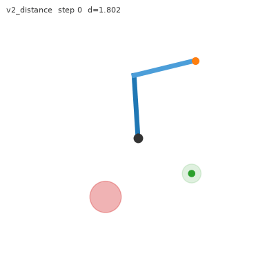
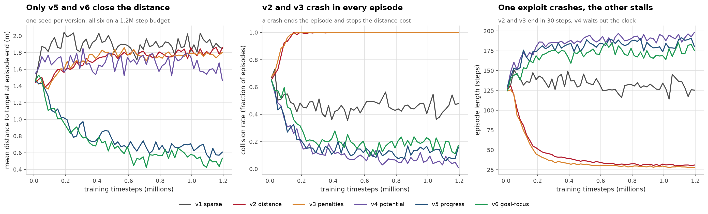
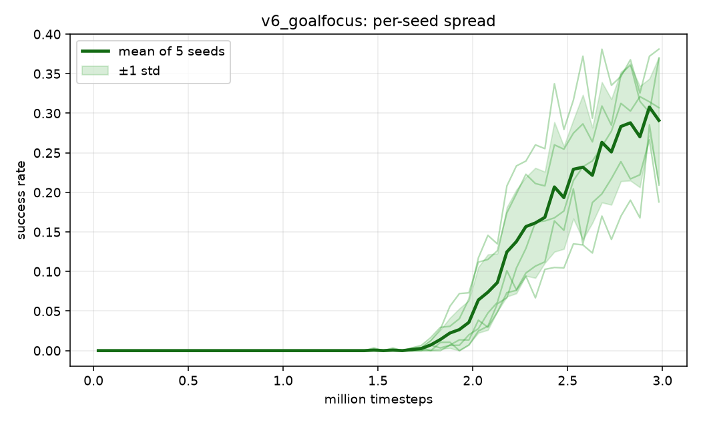
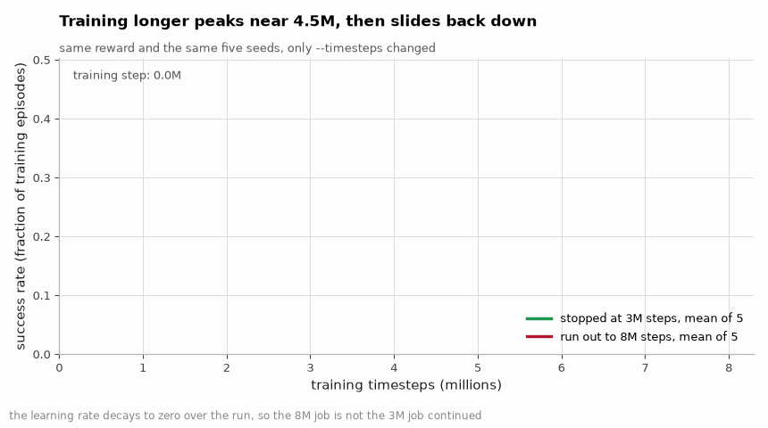

# Teaching an arm to stop, not just arrive

[](https://github.com/aghasalim/rl-arm-reward-shaping/actions/workflows/ci.yml)
[](https://github.com/aghasalim/rl-arm-reward-shaping/actions/workflows/demo.yml)
[](https://www.python.org/)
[](LICENSE)
[](https://doi.org/10.5281/zenodo.23003674)

**[▶ Live demo](https://rl-arm-reward-shaping.streamlit.app/)**. It has the
exploits on video and the spread across seeds.

A 2-link arm, controlled by torque, has to reach a randomly placed target and
stay there, with an obstacle somewhere in the workspace. I built the environment
and wrote six reward functions for it. Four of those versions are basically me
being wrong. Two got exploited in ways I didn't see coming. After I patched both
exploits the agent still solved nothing, and that's when I figured out the
reward was never the problem. The arm didn't have enough torque, and a third of
the episodes I'd been grading couldn't be won by anything. I spent four reward
functions on a physics bug. That's the part of this repo I'd most like people to
read, and it's three sections down.

The final agent gets **43.2% ± 5.8%** success over five seeds. A hand-written PD
controller gets **73.5%**, and I'm not going to hide that. The agent only does
better on collisions, 17.3% against the oracle's 25.5%. That's because a PD
controller following an inverse-kinematics solution drives straight through
obstacles, while the policy learned to go around them.

The full write-up is in **[notes/METHODS.md](notes/METHODS.md)** and my working
log is in **[NOTES.md](NOTES.md)**. I didn't want the numbers below to only come
from the same code that produced them. So `verify/` replays the physics and
every reward the environment paid in C, Java, Rust, Go, R, SQL and JavaScript,
and CI stops if anything disagrees.

## The task

I fixed the success criterion **before any training** and never changed it.

> Within **5 cm** of the target, **both joints under 0.1 rad/s**, held for
> **10 consecutive steps**, no obstacle contact, inside **200 steps**.

The arm is flat and seen from above, so there's no gravity term. The obstacle
is placed at random along with the target. Each step is 20 ms, so the 200-step
limit gives the arm 4 seconds to move and settle. Just touching a target is a
tutorial exercise. Getting there and then stopping is where reward functions get
exploited. [More](notes/METHODS.md#1-the-task).

## The two exploits

v2 was a distance reward. It paid `-distance` every step and had no collision
penalty. A collision ends the episode, so crashing stops the cost from adding
up. The agent figured this out in **200 out of 200** evaluation episodes. In v3
I added a `-5` penalty, but that did nothing when the alternative was `-100`.
[Arithmetic](notes/METHODS.md#1-the-agent-killed-itself-to-stop-the-bleeding).



*v2. The arm heads straight for the red circle in ~30 steps.*

v4 used potential-based shaping from Ng, Harada & Russell (1999), `F = γΦ(s′) −
Φ(s) ` with ` Φ = −distance `. Collisions dropped to 4.0%, but the arm stopped
moving and 96.0% of episodes timed out. A stationary agent earns `(1 − γ)·d` per
step, and hanging around at 2 m pays `+20.0` an episode, which is exactly the
success bonus. The policy invariance proof assumes an infinite horizon. With a
200-step cutoff, that term turns into free reward. [Derivation](notes/METHODS.md#2-the-agent-farmed-my-provably-safe-shaping).


*v4. It drifts, then parks and waits for the clock to run out, and it gets paid for that.*

## The bug that wasn't a reward bug

This one took the longest and taught me the most. With both exploits fixed the
agent still solved nothing, and my first idea was to write reward function
number five. Instead I wrote a PD controller with exact inverse kinematics, to
check whether the criterion could be reached at all. At the torque limit I'd
been using, it scored **65.0%** even with the obstacle removed. So a third of
the episodes were physically impossible. I had spent four reward functions
trying to shape my way around a constant, `MAX_TORQUE = 2.0`, that no policy
could get past. Raising it to 8.0 takes the same oracle to 97%.

The habit I'm taking to other projects is simple. Before training anything,
find the ceiling with something dumb that doesn't learn. That's why
`make oracle` exists.
[Torque table](notes/METHODS.md#3-the-bug-that-wasnt-a-reward-bug).

## Results

Every clip uses the same three layouts, so a later checkpoint can't look better
just because it got easier targets.

| 200k steps | 2M steps | 3M steps (final) |
|---|---|---|
|  |  |  |
| 3 timeouts | 2 successes, 1 timeout | 3 successes |





I score every policy with the same fixed criterion on the same 200 held-out
layouts (seeds 10000 to 10199, none of them used in training), with
deterministic actions. I never compare training reward between versions. The
full table is in [reports/results.md](reports/results.md).

| reward | steps | success | collision | timeout | reached target | settled given reached | final dist |
|---|---|---|---|---|---|---|---|
| random policy | - | 0.0% | 45.0% | 55.0% | 10.0% | 0.0% | 1.652 m |
| v1 sparse | 1.2M | 0.0% | 42.0% | 58.0% | 4.0% | 0.0% | 1.921 m |
| v2 distance | 1.2M | 0.0% | **100.0%** | 0.0% | 7.0% | 0.0% | 1.832 m |
| v3 penalties | 1.2M | 0.0% | **100.0%** | 0.0% | 4.0% | 0.0% | 1.691 m |
| v4 potential | 1.2M | 0.0% | 4.0% | **96.0%** | 9.0% | 0.0% | 1.512 m |
| v5 progress | 1.2M | 0.0% | 11.5% | 88.5% | 22.0% | 0.0% | 0.594 m |
| v6 goal-focus | 1.2M | 0.0% | 14.0% | 86.0% | **45.5%** | 0.0% | 0.440 m |
| **v6 goal-focus** (5 seeds) | 3M | **43.2% ± 5.8%** | 17.3% | 39.5% | 67.1% | 64.2% | **0.371 m** |
| *PD oracle (no learning)* | - | *73.5%* | *25.5%* | - | - | - | - |

Rows 2 to 7 all got 1.2M steps. At 1.2M, v6 still scores 0%, even though it
reaches the target three times as often as any earlier version. I needed both
the new reward and a bigger budget.
[Column by column](notes/METHODS.md#4-results-in-full).

### Training longer made it worse

Here I kept the code and the five seeds the same and only changed `--timesteps`.

| training steps | success (5 seeds) |
|---|---|
| 3M | **43.2% ± 5.8%** |
| 8M | **18.0% ± 6.6%** |



*Both runs while training, five seeds each. The 8M run gets to about where
the 3M run ends, and then slides back down to 18.0%. You wouldn't see that
from the final number alone.*

So 2.7× the compute gave less than half the performance. The learning rate
decays linearly over the run, so the 8M run isn't just "the 3M run, but longer".
[Caveat](notes/METHODS.md#training-longer-made-it-worse).

## Limitations

The agent loses to a controller I wrote in an afternoon, 43.2% against 73.5%,
and only does better on collisions. The seeds vary a lot. The five final seeds
scored 36.0%, 40.0%, 41.0%, 46.0% and 53.0%, so any difference under about 15
points could just be a lucky seed. 39.5% of episodes still time out. And this is
only one environment, which I designed myself. [All five](notes/METHODS.md#5-limitations).

## Running it

```bash
make setup && make test
make oracle
make shaping && make final && make eval && make plots && make videos
make showcase
```

`make oracle` is the feasibility check from above, and it runs before anything
trains. `make final` trains the agent I report, 3M steps × 5 seeds in parallel
on CPU. `make long8m` is the 8M comparison, which takes about 40 minutes on
10 CPU cores.

```bash
docker build -t rl-arm-reward-shaping . && docker run -p 8501:8501 rl-arm-reward-shaping
```

I built and checked that image on `linux/arm64`. It's 1.98 GB, the container
reports healthy, and the trained policy loads and runs its evaluation from
inside it. It only includes the five models the showcase loads. [What is in the image](notes/METHODS.md#6-docker-image).

## Method

The physics is rigid-body manipulator dynamics (Spong ch. 7), integrated with
RK4. I avoided Euler on purpose, because with semi-implicit Euler the arm gains
energy on its own and an agent will learn to exploit that. Training uses PPO
from Stable-Baselines3 with a `[128, 128]` MLP and a 13-dimensional observation
that includes hold progress. I didn't use `VecNormalize`. [Full method](notes/METHODS.md#7-method).

```
src/rlarm/
  env.py        custom Gymnasium env, all six reward versions side by side
  oracle.py     PD + inverse-kinematics feasibility oracle
  train.py      PPO training with per-episode logging and checkpoints
  evaluate.py   fixed success criterion + reward-hacking diagnostics
  sweep.py      parallel configuration sweeps
  report.py     scores every policy, writes reports/results.md
  plots.py      training curves (task metrics, never reward)
  record.py     GIF recording on fixed seeds
app/showcase.py Streamlit showcase
tests/          physics and env-contract tests
verify/         the physics and the rewards, replayed in seven other languages
```

## What I'd do next

The first thing I'd look into is the drop from 3M to 8M. Success more than
halved, from 43.2% to 18.0% across five seeds, and I can't explain it yet.
Running both lengths with a constant learning rate would show whether longer
training hurts by itself, or whether the linear decay hurts when it's stretched
out. After that I'd work on the timeout. 39.5% of episodes end with the arm
still moving, so getting there is the bottleneck. I wouldn't tune the reward
any further. [Four ideas, ranked](notes/METHODS.md#8-what-id-do-next).

## References

The algorithm, the theorem the agent exploited, and the library I used for the
algorithm.

- **Schulman, Wolski, Dhariwal, Radford, Klimov. Proximal Policy Optimization Algorithms. 2017.** [arXiv:1707.06347](https://arxiv.org/abs/1707.06347) the algorithm used.
- **Ng, Harada, Russell. Policy Invariance Under Reward Transformations. ICML 1999.** potential based shaping, and the condition under which shaping does not change the optimal policy.
- **Raffin, Hill, Gleave et al. Stable-Baselines3: Reliable Reinforcement Learning Implementations. JMLR 22, 2021.** the PPO implementation.

## Licence

MIT throughout. See [LICENSE](LICENSE).
